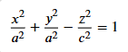
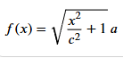
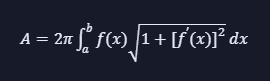
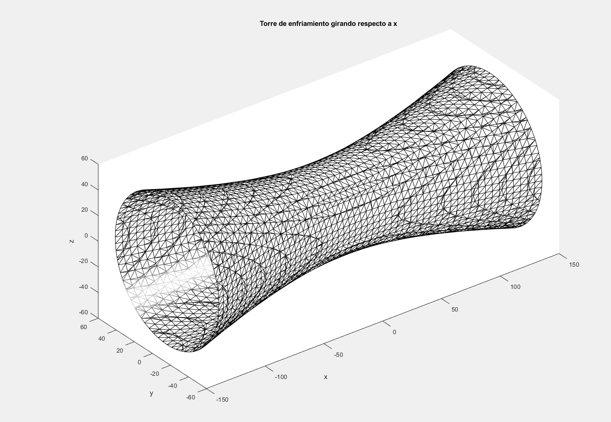

# 🧊 Torres de Enfriamiento como Superficies de Revolución

Este proyecto presenta el modelado de una torre de enfriamiento nuclear como una **superficie de revolución hiperboloide**, integrando conceptos de cálculo integral, ingeniería y visualización computacional.

---

## 📘 Descripción General

Una torre de enfriamiento se utiliza en plantas nucleares para disipar el calor sobrante. Su forma hiperboloide no solo es estética: maximiza el flujo de aire y mejora la eficiencia térmica. En este proyecto, se modela matemáticamente su estructura como una superficie generada al rotar una hipérbola.

---

## 🧮 Modelo Matemático

Se utiliza la ecuación general del **hiperboloide de una hoja**:





O también una curva generatriz para revolución alrededor del eje X:





Para calcular el **área superficial** generada:





---

## 📏 Medidas Reales y Maqueta a Escala

| Parámetro              | Real (m) | Escala 1:500 | Maqueta (cm) |
|------------------------|----------|--------------|---------------|
| Altura total           | 200      | 1:500        | 40            |
| Diámetro en la base    | 140      |              | 28            |
| Diámetro del cuello    | 70       |              | 14            |

---

## 💻 Código MATLAB/Octave

Este script genera una torre de enfriamiento en 3D:

```matlab
% Parámetros
a = 33.23; b = 33.23; c = 97.2; % radios

% Malla tridimensional (ahora el eje principal es X)
[X, Y, Z] = meshgrid(-137.5:5:137.5, -80:5:80, -80:5:80);

% Función implícita rotada: eje principal en X
V = (Y.^2)/(a^2) + (Z.^2)/(b^2) - (X.^2)/(c^2);

% Extraer superficie
p = patch(isosurface(X, Y, Z, V, 1));
set(p, 'FaceColor', 'w', 'EdgeColor', 'k');

% Estilo
daspect([1 1 1]);
view(3);
camlight;
lighting gouraud;
xlabel('x'); ylabel('y'); zlabel('z');
title('Torre de enfriamiento girando respecto a x');

```

