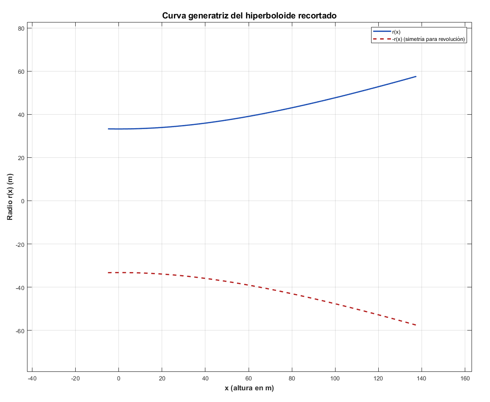
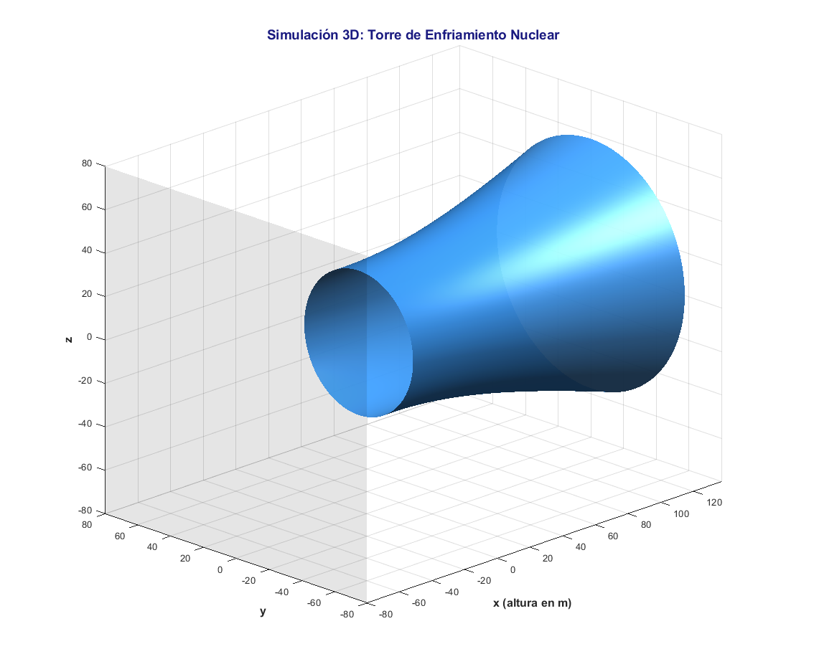
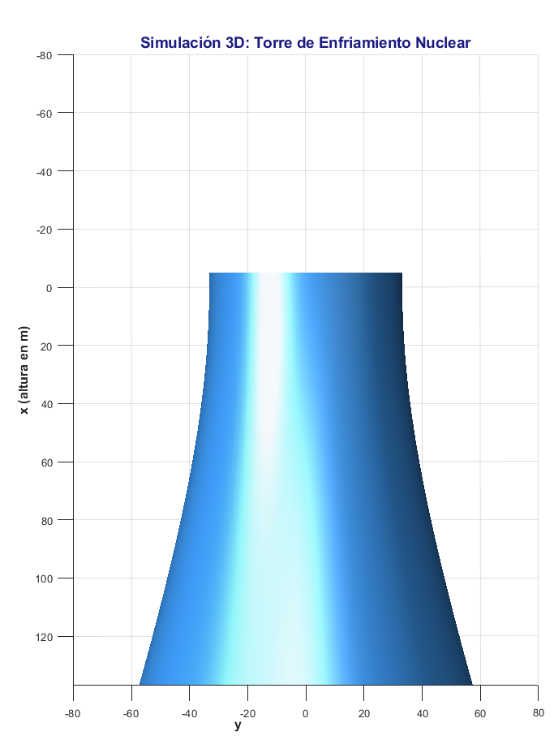

# 🧊 Torres de Enfriamiento como Superficies de Revolución

Este proyecto presenta el modelado de una torre de enfriamiento nuclear como una **superficie de revolución hiperboloide**, integrando conceptos de cálculo integral, ingeniería y visualización computacional.

---

## 📘 Descripción General

Una torre de enfriamiento se utiliza en plantas nucleares para disipar el calor sobrante. Su forma hiperboloide no solo es estética: maximiza el flujo de aire y mejora la eficiencia térmica. En este proyecto, se modela matemáticamente su estructura como una superficie generada al rotar una hipérbola.

---

## 🧮 Modelo Matemático

Se utiliza la ecuación general del **hiperboloide de una hoja**:


O también una curva generatriz para revolución alrededor del eje X:


Para calcular el **área superficial** generada:


---

## 📏 Medidas Reales y Maqueta a Escala

| Parámetro              | Real (m) | Escala 1:500 | Maqueta (cm) |
|------------------------|----------|--------------|---------------|
| Altura total           | 200      | 1:500        | 40            |
| Diámetro en la base    | 140      |              | 28            |
| Diámetro del cuello    | 70       |              | 14            |

---

## 💻 Código MATLAB

### Prototipo 1
Este script genera una torre de enfriamiento en 3D:

```matlab
% Parámetros
a = 33.23; b = 33.23; c = 97.2; % radios

% Malla tridimensional (ahora el eje principal es X)
[X, Y, Z] = meshgrid(-137.5:5:137.5, -80:5:80, -80:5:80);

% Función implícita rotada: eje principal en X
V = (Y.^2)/(a^2) + (Z.^2)/(b^2) - (X.^2)/(c^2);

% Extraer superficie
p = patch(isosurface(X, Y, Z, V, 1));
set(p, 'FaceColor', 'w', 'EdgeColor', 'k');

% Estilo
daspect([1 1 1]);
view(3);
camlight;
lighting gouraud;
xlabel('x'); ylabel('y'); zlabel('z');
title('Torre de enfriamiento girando respecto a x');

```


## Simulación Final
### Curva Generatriz

```matlab
% ===== Curva generatriz de la torre de enfriamiento =====
clc; clear; close all;

% === Parámetros reales ===
a = 33.23;      % radio mínimo en m
c = 97.2;       % parámetro vertical

% === Rango según el corte original: desde x = -5 a x = 137.5 m ===
x = linspace(-5, 137.5, 1000);
r = a * sqrt(1 + (x.^2) / c^2);  % fórmula del hiperboloide girado

% === Gráfica estilizada ===
figure('Color','w', 'Name','Curva Generatriz', 'NumberTitle','off');
plot(x, r, 'Color', [0.1 0.3 0.7], 'LineWidth', 2);
hold on;

% Reflejar la curva para mostrar revolución
plot(x, -r, 'Color', [0.7 0.1 0.1], 'LineWidth', 2, 'LineStyle', '--');

xlabel('x (altura en m)', 'FontSize', 12, 'FontWeight', 'bold');
ylabel('Radio r(x) (m)', 'FontSize', 12, 'FontWeight', 'bold');
title('Curva generatriz del hiperboloide recortado', ...
    'FontSize', 14, 'FontWeight', 'bold');

grid on;
axis equal;
legend('r(x)', '-r(x) (simetría para revolución)', 'Location', 'northeast');

```


### Superficie

```matlab
% ===== Torre de enfriamiento (hiperboloide recortado) =====
clc; clear; close all;

% === Parámetros geométricos reales ===
a = 33.23;     % radio mínimo (m)
b = 33.23;
c = 97.2;      % estiramiento vertical

% === Corte asimétrico: desde -5 m hasta 137.5 m (mismo que el original) ===
x_min = -5;
x_max = 137.5;

% === Malla más fina para suavidad ===
step = 1;
[X, Y, Z] = meshgrid(x_min:step:x_max, -80:step:80, -80:step:80);

% === Ecuación implícita del hiperboloide ===
V = (Y.^2)/(a^2) + (Z.^2)/(b^2) - (X.^2)/(c^2);

% === Visualización ===
figure('Color','w', 'Name','Torre de Enfriamiento 3D', 'NumberTitle','off');
p = patch(isosurface(X, Y, Z, V, 1));
isonormals(X, Y, Z, V, p);

% === Estética ===
set(p, ...
    'FaceColor', [0.2 0.5 0.8], ...     % azul acero
    'EdgeColor', 'none', ...
    'FaceAlpha', 0.95);                % casi opaco

% Base transparente (opcional)
hold on;
[xc, yc] = meshgrid(-80:1:80);
z_base = ones(size(xc)) * Z(1,1,1);
r_base = sqrt((xc.^2 + yc.^2));
mask = (r_base <= a * sqrt(1 + (x_min^2)/c^2)); % base circular
surf(z_base, xc, yc, 'FaceAlpha', 0.1, 'EdgeColor', 'none', 'FaceColor', [0 0 0]);

% === Cámara, luz y aspecto ===
daspect([1 1 1]);
view([-45 20]);             % ángulo 3D atractivo
camlight('right');
camlight('left');
lighting gouraud;

% === Ejes y título estilizados ===
xlabel('x (altura en m)', 'FontSize', 12, 'FontWeight', 'bold');
ylabel('y', 'FontSize', 12, 'FontWeight', 'bold');
zlabel('z', 'FontSize', 12, 'FontWeight', 'bold');
title('Simulación 3D: Torre de Enfriamiento Nuclear', ...
    'FontSize', 14, 'FontWeight', 'bold', 'Color', [0.1 0.1 0.5]);

grid on;
axis tight;


```


